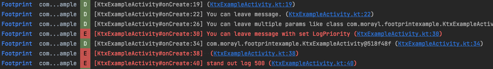

# Footprint
Debug logger for Android-Kotlin.

Usage
-----

 You just write `footprint()`, logcat shows `[ClassName#MethodName:LineNumber] + (links to the line of code)` when program reach the line.
 ```kotlin
 class SampleActivity: AppCompatActivity() {
     override fun onCreate(savedInstanceState: Bundle?) {
         super.onCreate(savedInstanceState)
         footprint() // [SampleActivity#onCreate:4] + (links to the line of code)
     }
 }
 ```
 Logcat shows as below. (When starting [KtxExampleActivity.kt](/app/src/main/java/com/morayl/footprintexample/KtxExampleActivity.kt).)

 

 Footprint has more useful functions, log multiple params, json, stacktrace, pair values, etc.
 Please see examples at [KtxExampleActivity.kt](/app/src/main/java/com/morayl/footprintexample/KtxExampleActivity.kt).  
 You can see library methods at [Footprint.kt](/footprint-ktx/src/main/java/com/morayl/footprintktx/Footprint.kt).

Download
--------

```groovy
repositories {
    maven { url 'https://raw.github.com/morayl/Footprint/master/repository' }
}
dependencies {
    debugImplementation 'com.morayl:footprint-ktx:1.2.0'
    releaseImplementation 'com.morayl:footprint-ktx-noop:1.2.0'
}
```
This library is suitable for bug investigation or log during development.  
Major functions are a little bit slow, because using `stack trace`.  
Recommend, using `debugImplementation` and remove footprint's codes before release build.   
Or use `footprint-ktx-noop` in releaseImplementation.   
Or use `implementation` and switch enable using `configureFootprint(enable = BuildConfig.DEBUG)`.   

ChangeLog
--------

 See [ChangeLog](./CHANGELOG.md)
 
Old library(Footprint.java)
---------------------------
Footprint.java has stopped development.  
But you can use. ([Readme](./README_for_java.md) / [ChangeLog](./CHANGELOG_for_java.md)).  
In Java, you "can" use Footprint-ktx to write FootprintKt.~ but it's not useful.

License
--------

    Copyright 2022 morayl

    Licensed under the Apache License, Version 2.0 (the "License");
    you may not use this file except in compliance with the License.
    You may obtain a copy of the License at

       http://www.apache.org/licenses/LICENSE-2.0

    Unless required by applicable law or agreed to in writing, software
    distributed under the License is distributed on an "AS IS" BASIS,
    WITHOUT WARRANTIES OR CONDITIONS OF ANY KIND, either express or implied.
    See the License for the specific language governing permissions and
    limitations under the License.
